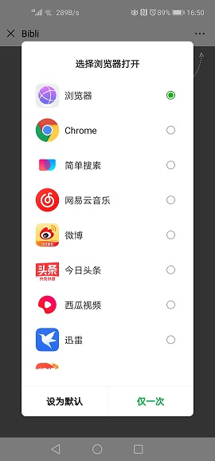
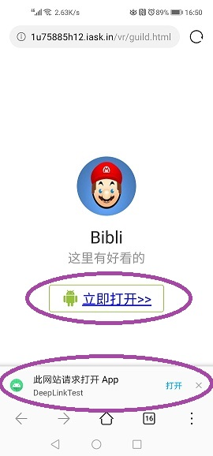

# DeepLinkDemo
Deeplink 测试，公网http链接到微信，引导用户默认浏览器打开，然后activity接受传值

运行环境
  tomcat 运行web页面
  花生壳 映射到公网（不映射使用局域网IP地址 也可以的）
  Android Studio
  java
  
Tips:
  因为微信浏览器不支持打开隐式调用，所以这里我使用了引导页。其实基本可以。
  没必要去整个第三方SDK，因为毕竟只是为了学习以下。真正以后需要的时候还是得实际情况具体分析

